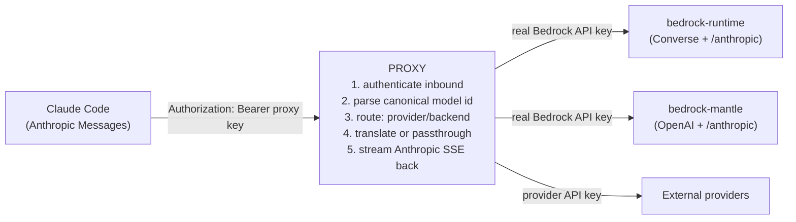

# claude-code-provider-proxy

[](https://github.com/MajorProg/claude-code-provider-proxy/actions/workflows/ci.yml)
[](LICENSE)
[](https://bun.sh)

An **Anthropic-Messages-mode proxy for [Claude Code](https://code.claude.com)**:
it lets Claude Code drive **any** model from **any** provider behind a single
Anthropic-compliant endpoint. Point Claude Code at the proxy once, then use
Claude, Qwen, GLM, GPT-OSS, DeepSeek, Nova, Llama, Mistral, Gemini, Kimi, and
more — served from **AWS Bedrock** (Claude *and* non-Claude models) and from
**external providers** (DeepSeek, z.ai, Gemini, Alibaba, EUrouter, Mistral,
Moonshot). Bedrock and external providers are first-class peers; the proxy
translates each request to whatever wire format the chosen model needs.

- **One endpoint, any model, any provider** — Claude Code always speaks the
  Anthropic Messages API; the proxy translates outbound per model, whether the
  model lives on Bedrock or an external provider.
- **No hardcoded model catalog** — providers, regions, and models are
  discovered at runtime, so new releases show up without a code change.
- **Streaming + tool use** across every provider, verified against live
  upstreams.
- **Cross-platform Bun CLI** to set up, run (local or Docker), and inspect the
  proxy on macOS, Linux, and Windows.
- **LAN-only by default** — never binds `0.0.0.0`; secrets are never baked
  into config on disk.

See [`docs/index.md`](docs/index.md) for a navigable code summary, and
[`AGENTS.md`](AGENTS.md) for the binding project rules and live-verified
per-provider facts.

## Table of contents

- [Why this exists](#why-this-exists)
- [Quick start](#quick-start)
- [Configure Claude Code](#configure-claude-code)
- [Canonical model IDs](#canonical-model-ids)
- [Configuration](#configuration-configlocaljsonc)
- [Local development](#local-development-without-docker)
- [Architecture](#architecture)
- [Contributing](#contributing)
- [License](#license)

---

## Why this exists

Claude Code speaks exactly one wire protocol: the **Anthropic Messages API**
(`POST /v1/messages`). That's great if you only ever use Anthropic's own models
— but the models you want may live elsewhere: on AWS Bedrock, or behind an
external provider's API, each with its own request/response format.

This proxy sits in front of Claude Code and bridges that gap. Inbound it always
speaks the Anthropic Messages format; outbound it translates each request to
whatever the chosen model needs, then streams the response back as Anthropic
SSE. Claude Code doesn't know or care where the model runs — it just sees one
Anthropic-compliant endpoint.

Under the hood the proxy picks one of three outbound paths per model, chosen by
the model's canonical id (not by guessing from its name):

- **Native Anthropic passthrough** — for Claude models (on Bedrock's Mantle
  backend) and for external Anthropic-compatible providers (e.g. DeepSeek,
  z.ai). The body is relayed almost unchanged; near-zero translation.
- **Bedrock Converse** — for any model addressed via Bedrock's `bedrock-runtime`
  Converse API (Bedrock-native schema + binary event stream).
- **OpenAI Chat Completions** — for non-Claude models on Bedrock's Mantle
  backend and for external OpenAI-compatible providers (e.g. Gemini, Mistral).

You never choose a path directly — you pick a model, and the proxy routes it.

---

## Quick start

The proxy runs two ways — pick either. A single **cross-platform Bun CLI**
(Windows, macOS, Linux) drives both:

- **Local mode** (`--local`) — runs the proxy as a bare Bun process. No Docker
  required. Fastest inner loop; great on Windows.
- **Docker mode** (`--docker`) — runs the proxy in a container via
  `docker compose`. Default when Docker is detected.

One-time, from clone to a configured Claude Code:

```bash
git clone https://github.com/MajorProg/claude-code-provider-proxy.git
cd claude-code-provider-proxy

# If Bun isn't installed yet, use the bootstrap shim (installs Bun, then the CLI):
./bootstrap.sh setup            # macOS/Linux
#   .\bootstrap.ps1 setup       # Windows (PowerShell)

# Once Bun is installed, use the CLI directly:
bun run cli setup               # deps + Claude Code + config + auth token
bun run cli up                  # start (auto-picks docker if present, else local)
```

`setup` is fully automated and does all of this:

1. Checks the runtime (Bun) and, for Docker mode, that the Docker daemon is up.
2. Bootstraps `.env` and `config.local.jsonc` from the examples if missing.
3. **Generates a strong shared auth token** (`ccpp_…`, 256-bit) into
   `PROXY_INBOUND_KEY` — used by both the proxy *and* Claude Code. Existing real
   tokens are never overwritten (use `--rotate` to force a new one).
4. **Auto-derives `BIND_IP`** (your LAN IPv4) and writes it to `.env`.
5. Installs **Claude Code** if missing (OS-aware), backing up any existing
   `~/.claude/settings.json` (timestamped) before pointing it at the proxy.

### Commands

```bash
bun run cli <command> [--local|--docker] [--rotate]
```

| Command | Does |
|---|---|
| `setup` | install deps + Claude Code, bootstrap config, generate shared auth token, configure Claude Code |
| `up` / `start` | start the proxy (Docker or local process) |
| `down` / `stop` | stop the proxy |
| `restart` | stop then start |
| `status` | run status + registry URLs |
| `logs` | follow logs (container logs, or the local logfile) |
| `config-claude` | (re)write `~/.claude/settings.json` (backs up first) |
| `doctor` | diagnose environment (deps, `BIND_IP`, config) |
| `help` | list commands |

**Mode selection:** pass `--local` or `--docker`. With neither, the CLI uses
Docker if it's installed, otherwise local.

**Before first launch**, edit `.env`:

- `BEDROCK_API_KEY` — **optional**. Your long-term AWS Bedrock API key
  (region-agnostic bearer). Leave empty to disable Bedrock entirely and run on
  external providers only. (For local dev without a long-term key, set the
  config credential to `dev` and export `AWS_ACCESS_KEY_ID`/
  `AWS_SECRET_ACCESS_KEY`; the proxy mints short-lived per-region tokens.)
- Any external provider key you have — e.g. `ZAI_API_KEY`, `DEEPSEEK_API_KEY`.
  The shipped config lists both providers with empty `"${VAR:-}"` defaults, so
  setting the key in `.env` is all it takes to activate that provider.
- `PROXY_INBOUND_KEY` — auto-generated by `setup`; you rarely touch it.
- `PORT` — host port (default `8787`).
- `BIND_IP` — **auto-derived** (leave blank to let `setup`/`up` pick your LAN
  IPv4). The proxy is published only on this address + `127.0.0.1`, never
  `0.0.0.0`, and never a VPN/virtual interface. Applies to Docker (host-port
  publish) and local (server bind); on managed platforms (ECS/K8s) it does not
  apply — network exposure is controlled at the platform layer instead.

### External providers only (no Bedrock)

You don't need any AWS credentials. Bedrock is optional — an empty or
placeholder `BEDROCK_API_KEY` simply disables it, and requests for
`bedrock.*` models get a clean `404 Provider "bedrock" is disabled` error
while every configured external provider keeps working:

```bash
bun run cli setup
echo "ZAI_API_KEY=your-zai-key" >> .env   # activates z.ai (already in the shipped config)
bun run cli restart
```

The registry at `/` then lists the provider's models (e.g.
`zai.anthropic.global.glm-5.3`) and `bun run cli doctor` reports the
per-provider state. If **no** provider has a usable key, the proxy still boots
with an empty catalog — the config UI at `/config` stays reachable so you can
paste keys there (Save hot-reloads, no restart).

Provider credentials in `config.local.jsonc` support bash-like defaults:
`"${ZAI_API_KEY:-}"` resolves to the env var when set (non-empty) and to the
empty default otherwise — an empty credential means "skipped until the key is
set", not a config error. Bare `"${VAR}"` references stay strict (unset/empty
fails the config load with a clear error). Note that env changes need a
restart (or a config-UI reload); also, a config-UI save while a credential is
empty writes `""` in place of the `"${VAR:-}"` reference, so after such a save
set keys via the UI (or re-add the reference).

### Registry page

Once running, open **`http://127.0.0.1:8787/`** for a live registry view of every
discovered provider, region, backend, and model (with canonical IDs, inference
profiles, and streaming support). Machine-readable at `/status.json`.

---

## Configure Claude Code

Set these environment variables (or the equivalent in your Claude Code settings):

```json
{
  "env": {
    "ANTHROPIC_BASE_URL": "http://127.0.0.1:8787",
    "ANTHROPIC_AUTH_TOKEN": "<your PROXY_INBOUND_KEY>",
    "ANTHROPIC_API_KEY": "",
    "ANTHROPIC_MODEL": "bedrock.mantle.eu.anthropic.claude-sonnet-5",
    "ANTHROPIC_DEFAULT_SONNET_MODEL": "bedrock.mantle.eu.anthropic.claude-sonnet-5",
    "ANTHROPIC_SMALL_FAST_MODEL": "bedrock.mantle.eu.anthropic.claude-haiku-4-5",
    "ANTHROPIC_DEFAULT_HAIKU_MODEL": "bedrock.mantle.eu.anthropic.claude-haiku-4-5"
  }
}
```

The four model ids above are illustrative — use any discovered canonical id from
any provider (see [Canonical model IDs](#canonical-model-ids)); `bun run cli
status` and the registry at `/` list what's available. The example uses Claude
on Bedrock via the native Anthropic passthrough
(`bedrock.mantle.<region>.anthropic.*`), but you could just as well point these
at a non-Claude Bedrock model or an external provider.

- `ANTHROPIC_MODEL` / `ANTHROPIC_SMALL_FAST_MODEL` — the primary and
  small/fast models Claude Code uses.
- `ANTHROPIC_DEFAULT_SONNET_MODEL` / `ANTHROPIC_DEFAULT_HAIKU_MODEL` — the
  Sonnet/Haiku aliases Claude Code's auto-mode classifier resolves. Pin these to
  concrete canonical ids so auto-mode resolves cleanly rather than falling back
  to Anthropic's default names.

### Two mandatory gotchas

1. **`ANTHROPIC_API_KEY` must be empty (`""`).** If it holds any non-empty value,
   Claude Code prefers it over `ANTHROPIC_AUTH_TOKEN` and **bypasses the proxy**.
2. **`ANTHROPIC_BASE_URL` must not end in `/v1`.** Claude Code appends
   `/v1/messages` itself; a `/v1` suffix produces `/v1/v1/messages` → 404.

---

## Canonical model IDs

Models are addressed with a provider-agnostic canonical ID:

```
<provider>.<backend>.<profilePrefix>.<nativeModelId>
```

| Segment | Values | Meaning |
|---|---|---|
| `provider` | `bedrock`, or an external provider key (e.g. `deepseek`, `gemini`) | which provider serves the model (drives credential + outbound driver) |
| `backend` | `converse`, `mantle`, `anthropic`, `openai` | which wire format / translation path is used |
| `profilePrefix` | `global`, `us`, `eu` | region + inference-profile family (`global` for single-endpoint externals) |
| `nativeModelId` | provider's real model id | may contain dots/colons |

Examples:

```
bedrock.mantle.eu.anthropic.claude-sonnet-5      # Claude on Bedrock, native Anthropic passthrough
bedrock.converse.global.anthropic.claude-sonnet-5 # same Claude model, via Bedrock Converse
bedrock.mantle.us.qwen.qwen3-coder-30b-a3b-v1:0  # non-Claude on Bedrock, OpenAI-format translation
bedrock.converse.eu.amazon.nova-lite-v1:0        # Bedrock Nova, via Converse
deepseek.anthropic.global.deepseek-chat          # external provider, native Anthropic passthrough
gemini.openai.global.gemini-2.5-pro              # external provider, OpenAI-format translation
```

You pick a model id; the proxy reads its `provider` + `backend` and routes it —
you never choose a translation path by hand. In practice:

- **Claude models** are served over the **native Anthropic route** with almost
  no translation — whether that's Bedrock's Mantle backend
  (`bedrock.mantle.<region>.anthropic.*`) or an external Anthropic-compatible
  provider (`<provider>.anthropic.global.*`). The same Claude model can also be
  addressed via Bedrock **Converse** (`bedrock.converse.*.anthropic.*`) if you
  prefer that backend.
- **Non-Claude models** are translated to the format their backend expects —
  Bedrock **Converse** (`/model/{id}/converse`) or the **OpenAI Chat
  Completions** format used by Bedrock Mantle and external OpenAI-compatible
  providers (`/v1/chat/completions`).
- `global.*` resolves to the configured **primary region**; `us`/`eu` select that
  region's endpoint host and inference-profile family. External providers are
  single-endpoint, so they use `global`.

Model availability is **discovered at runtime** per region — no model list is
hardcoded. New models appear automatically once the upstream lists them.

---

## Configuration (`config.local.jsonc`)

See [`config.example.jsonc`](config.example.jsonc). Key fields:

- `regions` — region families → AWS regions (default `us` → `us-east-1`,
  `eu` → `eu-west-1`, chosen by measured model coverage).
- `primaryRegion` — where `global.*` resolves; the region with the latest models.
- `profilePreference` — `global` | `regional` | `auto`.
- `providers.bedrock.credential` — `${BEDROCK_API_KEY}` (interpolated from env).
- `providers.bedrock.hosts` — templated with `{region}`; never hardcoded per-region.
- `providers.<external>` — optional non-Bedrock providers, each with a `type`
  (`anthropic` | `openai`), `auth` style, `baseUrl`, and a `modelsUrl` discovery
  endpoint.

Secrets are interpolated via `${ENV_VAR}` at load time and restored to `${ENV}`
form when saved via the Config UI — never committed as resolved values.

---

## Local development (without Docker)

```bash
bun install
bun run typecheck     # strict TypeScript, zero errors
bun run lint          # biome, zero warnings
bun run test:unit     # hermetic test suite (the merge gate — no network)
bun run dev           # watch-mode server
```

### Testing: two lanes

Tests run in two complementary lanes:

- **Hermetic lane** — `bun run test:unit` (also plain `bun test`). The merge
  gate. It mocks **only** the outbound `fetch` boundary and replays **real
  upstream responses** captured once from live endpoints (`tests/fixtures/`), so
  the full translation/streaming/routing code runs against authentic data with
  no network and no provider cost.
- **Live lane** — `bun run test:live` (`RUN_LIVE=1 bun test`). Hits real AWS
  Bedrock + external-provider endpoints; the ultimate source of truth. Requires
  credentials in the environment:

  ```bash
  export AWS_ACCESS_KEY_ID=... AWS_SECRET_ACCESS_KEY=... AWS_SESSION_TOKEN=...
  bun run test:live
  ```

  Short-lived Bedrock tokens are region-scoped; the discovery client mints one
  per region. A production long-term key is region-agnostic.

Re-capture the hermetic fixtures when an upstream contract changes:
`bun run test:capture` (needs live credentials).

---

## Architecture

Claude Code sends Anthropic Messages to the proxy; the proxy authenticates the
request, resolves the canonical model id to a provider + backend, translates (or
passes through) to that upstream, and streams the reply back as Anthropic SSE.
Bedrock and external providers are handled the same way — the only difference is
which credential and wire format each target needs.



Full contracts, translation tables, streaming grammar, and per-provider verified
facts are in [`AGENTS.md`](AGENTS.md). A navigable code summary is in
[`docs/`](docs/index.md).

---

## Contributing

Contributions are welcome. See [`CONTRIBUTING.md`](CONTRIBUTING.md) for
development setup, coding standards, testing, and the contribution workflow;
[`AGENTS.md`](AGENTS.md) has agent-oriented and per-provider guidance.

---

## License

[MIT](LICENSE) © 2026 Felix Willig. Free to use, modify, and distribute;
attribution (keeping the copyright notice) is required.
