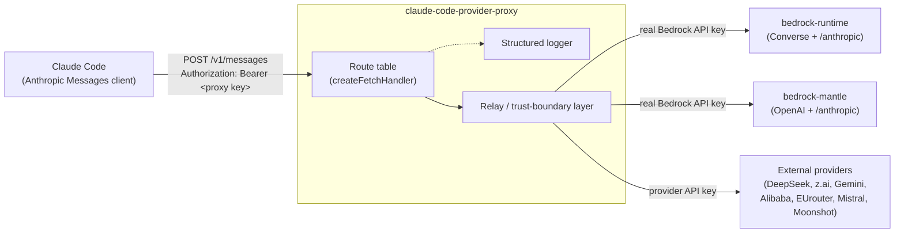
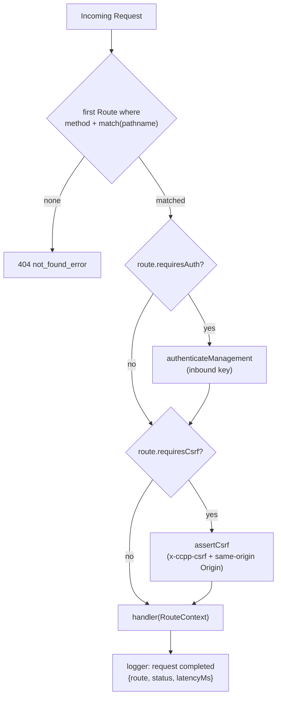
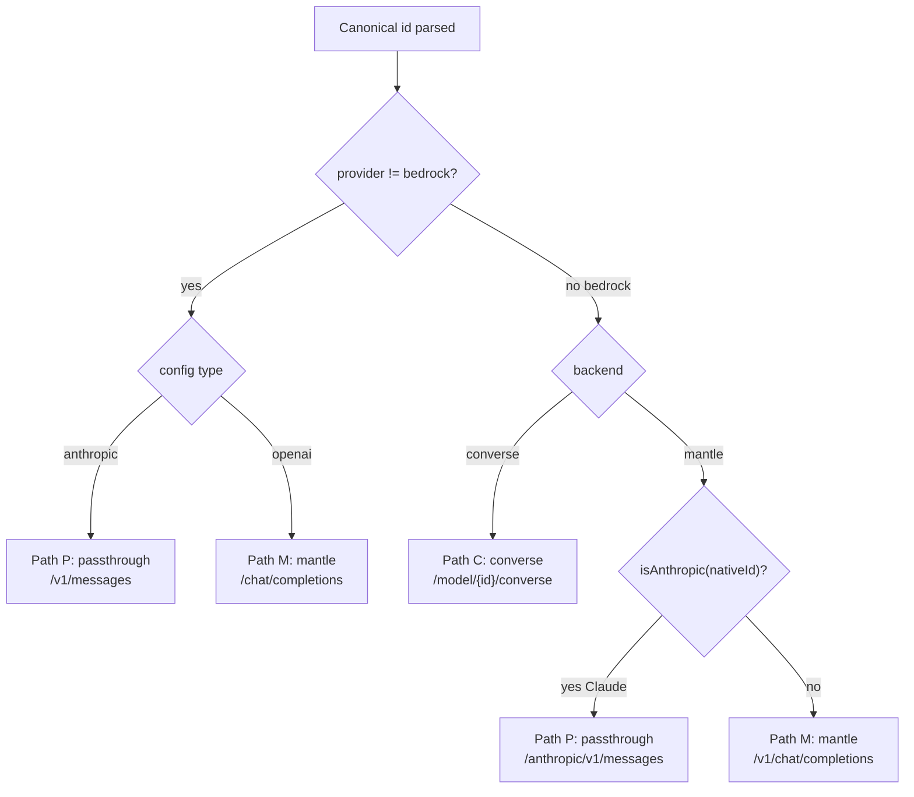
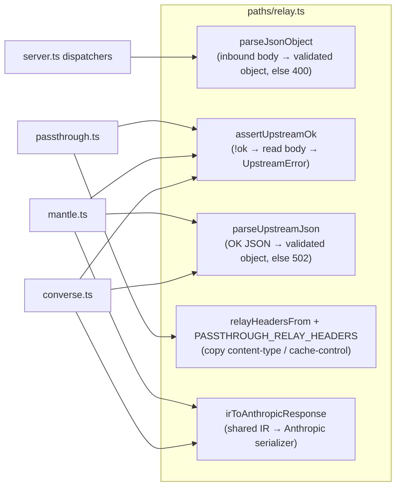
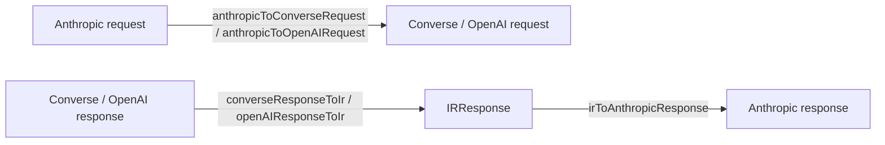
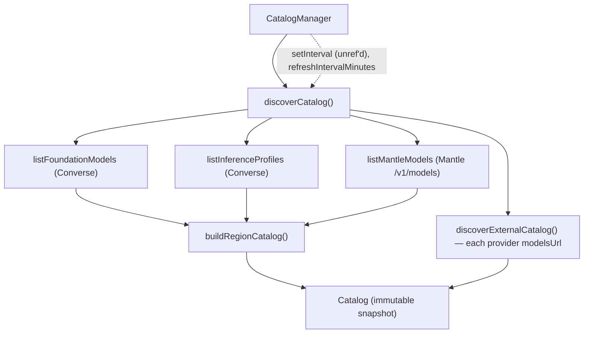

# Architecture

This document describes the system architecture, the request lifecycle, the
three translation paths, and the core design patterns.

---

## System context



Claude Code is configured with `ANTHROPIC_BASE_URL` pointing at the proxy and
`ANTHROPIC_AUTH_TOKEN` set to the proxy's inbound key. Every request enters
through the **declarative route table** in `server.ts`
(`createFetchHandler`), which matches the method + path to a `Route`, applies
that route's auth/CSRF gates, and dispatches to a handler. Inference handlers
authenticate the inbound request, resolve the canonical model id to an upstream
target, translate the payload if needed via the shared **relay/trust-boundary
layer** (`src/paths/relay.ts`), and stream an Anthropic-shaped response back.
The **structured logger** (`src/logging/logger.ts`) records a correlation id,
route name, status, and latency for each request — identifiers only, never
secrets.

---

## Request lifecycle

```mermaid
sequenceDiagram
    participant CC as Claude Code
    participant FH as createFetchHandler (route table)
    participant AU as auth/inbound.ts
    participant RL as paths/relay.ts
    participant RT as router.ts
    participant CAT as model/catalog.ts
    participant TP as auth/token-provider.ts
    participant PH as paths/* handler
    participant UP as upstream provider
    participant LG as logging/logger.ts

    CC->>FH: POST /v1/messages (Anthropic body)
    FH->>LG: newRequestId(); debug "request received"
    FH->>FH: match Route (method + path); apply requiresAuth / requiresCsrf
    FH->>AU: authenticateInbound(headers, keys)  %% inference self-authenticates
    AU-->>FH: ok (else 401)
    FH->>RL: parseJsonObject(await req.text())  %% parse body ONCE
    RL-->>FH: validated JSON object (else 400)
    FH->>RT: route(config, catalog, canonicalId)
    RT->>CAT: catalog.get(regionKey, backend, nativeId)
    RT->>CAT: resolveInvocationId(model, preference)
    RT-->>FH: RouteTarget (origin, path, invocationId, translationPath)
    FH->>TP: tokenProvider(awsRegion)  %% or external static key
    TP-->>FH: bearer credential (per-region cached for dev tokens)
    FH->>PH: handle{Passthrough|Converse|Mantle}Messages(parsed, ...)
    PH->>UP: POST (translated or verbatim body)
    UP-->>PH: JSON or SSE stream
    PH->>RL: assertUpstreamOk / parseUpstreamJson / irToAnthropicResponse
    RL-->>PH: Anthropic-shaped body or typed UpstreamError
    PH-->>FH: Anthropic-shaped Response
    FH-->>CC: relay (optionally tee'd to LogStore)
    FH->>LG: info "request completed" {route, status, latencyMs}
```

Notes on the current lifecycle:

- **Parse the body once.** Dispatchers read `req.text()` and hand the raw text
  to `parseJsonObject` (from `relay.ts`) a single time, then thread the parsed
  object through routing, inference, and capture — no re-parse per stage. A
  non-object body fails fast with `400` rather than a downstream cast.
- **Per-region Bedrock token cache.** In dev mode, `token-provider.ts` mints a
  short-lived, region-scoped SigV4 token and **caches it per region**, de-duping
  concurrent mints via the stored in-flight promise and re-minting a skew before
  expiry. A long-term production key is region-agnostic and returned directly.
- **Correlation + timing.** Each request gets a short `requestId`
  (`newRequestId()`); the handler logs completion with the matched route name,
  status, and `latencyMs` (at `info` for `/v1/*` and `/api/*`, `debug`
  otherwise).

---

## The route table

`createFetchHandler(getRuntime, reloadRuntime)` builds the request handler
around a declarative `ROUTES: Route[]` table instead of a monolithic
`if/else`. Each `Route` carries `{method, name, match, requiresAuth,
requiresCsrf?, handler}`.



- **Matchers.** `exact(...paths)` matches one of several equivalent literal
  paths; `prefix(base)` matches a base and captures the remaining `/`-split,
  non-empty, `decodeURIComponent`'d segments (used for the log system-hash /
  session routes). Order matters only for overlapping prefixes — the specific
  `exact` routes precede their `prefix` siblings.
- **Auth policy.** The management/observability **API** endpoints
  (`/api/config*`, `/api/logs/*`, `/api/chat`) set `requiresAuth: true` and are
  gated by `authenticateManagement` (the same inbound key that protects
  inference). The HTML **shells** (`/config`, `/logs`, `/chat`) stay public —
  they are static markup carrying no secret; the browser attaches the key from
  session storage on each fetch. The inference endpoints self-authenticate
  inside their dispatchers.
- **CSRF.** State-changing management POSTs (`POST /api/config`, `POST
  /api/chat`) additionally set `requiresCsrf: true`; `assertCsrf` requires the
  custom `x-ccpp-csrf` header (which a cross-origin simple request cannot set
  without a preflight the server never approves) and rejects a mismatched
  `Origin` when present.
- **Testability.** Because the handler is extracted from `main()`, a test can
  build a `Runtime` with a stub catalog and drive plain `Request`s through
  `createFetchHandler` — no `Bun.serve`, no live discovery.

---

## The three translation paths

The router (`route()` in `src/router.ts`) resolves each request to exactly one
`translationPath`. Selection is deterministic and driven by the canonical id
and, for external providers, the config `type` discriminator.



| Path | Name | When | Translation | Streaming bridge |
|---|---|---|---|---|
| **P** | `passthrough` | Claude on Bedrock Mantle's native Anthropic route; external `type: anthropic` providers | None — rewrites only the `model` field, relays body & SSE byte-for-byte | Upstream SSE relayed unchanged |
| **C** | `converse` | Any `bedrock.converse.*` model (Claude and non-Claude) | Anthropic ⇄ Bedrock Converse (via IR) | `converse-events.ts` decodes binary eventstream → Anthropic SSE |
| **M** | `mantle` | Non-Claude on Bedrock Mantle; external `type: openai` providers | Anthropic ⇄ OpenAI Chat Completions (via IR) | `openai-sse.ts` parses OpenAI SSE → Anthropic SSE |

Key routing rules (from `router.ts`):
- The **converse backend always uses the Converse API**, even for Claude — no
  cross-backend fallback. Native Anthropic passthrough is reserved for the
  Mantle backend and external anthropic providers.
- **Claude is rejected on Mantle's OpenAI route**, so Claude on Mantle uses the
  native `/anthropic/v1/messages` route (Path P).
- The **Converse route requires `Authorization: Bearer`** and rejects
  `x-api-key` (403); Mantle accepts bearer.

---

## The relay / trust-boundary layer

Paths C and M (and the passthrough count-tokens/message handlers) share
`src/paths/relay.ts`, which consolidates patterns that were duplicated across
the handlers. Treating every inbound/upstream JSON payload as untrusted is a
deliberate trust boundary — never a bare `JSON.parse(...) as T`.



- **`irToAnthropicResponse` is shared by BOTH `converse.ts` and `mantle.ts`** —
  they emit the identical Anthropic envelope and content-block mapping.
  Prompt-cache usage counters (`cache_read_input_tokens` /
  `cache_creation_input_tokens`) are emitted only when the IR carries them, so
  the mantle path (which never sets them) stays flat `{ input_tokens,
  output_tokens }`.
- **`parseUpstreamJson` / `assertUpstreamOk`** turn provider anomalies into
  typed `UpstreamError`s carrying route/model context for logs (surfaced in
  logs only, never in the client body).

---

## Intermediate representation (IR)

Paths C and M translate through a shared, provider-neutral IR
(`src/ir/types.ts`). Path P bypasses the IR entirely (pure passthrough). The IR
mirrors Anthropic's shape because Anthropic is the inbound/outbound wire format.



The request side maps per content block into the provider schema directly (there
is no `IRRequest` wrapper type); the response side normalizes into a shared
`IRResponse` and then `irToAnthropicResponse` (in `paths/relay.ts`) serializes it
back to an Anthropic message for both Path C and Path M.

See [`data_models.md`](data_models.md) for the full IR type definitions.

---

## Runtime model discovery

No model list is hardcoded. `CatalogManager.start()` performs initial discovery
(never fatal), then refreshes on a timer.



- Discovery is authenticated with the same Bedrock bearer token used for
  inference (control-plane accepts it), obtained through the per-region-cached
  token provider. When Bedrock is disabled (`bedrock-mode.ts`: absent block,
  empty/placeholder credential, or `dev` without AWS creds) the discovery
  client is `null` — zero Bedrock network calls.
- **No discovery failure is fatal.** Every region (including the primary) and
  every external provider gets a `SourceStatus` (`ok|error|skipped|disabled`)
  on the immutable `Catalog`, surfaced via `/status.json` and
  `/api/config/status`. Requests for a disabled provider get a 404
  `ProviderDisabledError`.
- A refresh failure retains the previous catalog. The refresh timer is
  `unref()`'d so it never keeps the process alive on its own.

---

## Design patterns

| Pattern | Where | Why |
|---|---|---|
| **Declarative route table** | `ROUTES: Route[]` + `createFetchHandler` in `server.ts` | The table (not a mid-chain conditional) is the single source of truth for method, path, and per-route auth/CSRF gates; each handler is a small, testable function. |
| **Dependency-injection seams (structural types)** | `DiscoveryClient`, `RegionTokenProvider`, `HeaderReader`, `getRuntime`/`reloadRuntime` | Enables real (non-mock) test doubles and decouples from concrete `Headers`/DOM types; lets tests drive the handler without `Bun.serve`. |
| **Immutable snapshot + atomic swap** | `Catalog` / `CatalogManager`; single `Runtime` reference in `server.ts` | Reads never see a half-built catalog; config hot-reload swaps a whole `Runtime` atomically. |
| **Serialized critical section (mutex)** | `createSerializer()` gating `reloadRuntime` | Concurrent `POST /api/config` calls apply in order — no interleave, no lost reload, no leaked `CatalogManager` timer; a rejection does not poison the chain. |
| **Trust boundary / anti-corruption** | `relay.ts` (`parseJsonObject`, `parseUpstreamJson`, `assertUpstreamOk`) + IR translators | Every untrusted JSON payload is validated as an object before use; malformed inbound → 400, malformed upstream → 502. |
| **Strategy** | The three `paths/*` handlers behind `translationPath` | One dispatch point, three interchangeable translation strategies sharing `relay.ts`. |
| **Passthrough / relay** | `paths/passthrough.ts` + `relayHeadersFrom` | Preserves upstream bodies and SSE byte-for-byte (Claude Code retry logic matches upstream wording). |
| **Transparent tee** | `logging/capture.ts` | Observability without altering or blocking the client response. |
| **Leveled structured logging** | `logging/logger.ts` | Correlation id + route + status + latency as `key=value` fields; identifiers only, never secrets or bodies. |
| **Fail fast on config, degrade gracefully at runtime** | strict `validateConfig`/`loadConfig` vs non-fatal discovery | Config errors fail loudly before boot; any discovery failure (Bedrock region or external provider) degrades to that source's absence with a surfaced `SourceStatus` instead of crashing the proxy. |

---

## Hot-reload & configuration lifecycle

`POST /api/config` (auth + CSRF gated) calls `reloadRuntime`, which runs inside
the `createSerializer()` mutex. Ordering matters: it validates the incoming
config, **builds a fresh `Runtime` first** (so a build failure never persists a
broken config), then persists it (restoring `${ENV}` references for secrets so
resolved secrets are never baked to disk), swaps the single runtime reference
atomically, and finally stops exactly the `CatalogManager` and `LogStore` it
replaced — all without a process restart.

---

## Security boundaries

- **Inbound auth** is independent of any provider credential; it only gates the
  proxy. Validation is constant-time to avoid timing leaks. Management API
  routes are gated by `authenticateManagement` via the route table's
  `requiresAuth` flag.
- **CSRF on state-changing POSTs.** `POST /api/config` and `POST /api/chat`
  require the `x-ccpp-csrf` header and a same-origin `Origin` (`assertCsrf`), so
  an authenticated key sitting in a browser session cannot be driven
  cross-origin.
- **HTML hardening.** All served HTML pages carry a Content-Security-Policy plus
  `X-Content-Type-Options: nosniff` and `Referrer-Policy: no-referrer`. The CSP
  locks `connect-src` to `'self'` (all API calls are same-origin) and
  `object-src`/`base-uri`/`frame-ancestors` to `'none'`.
- **Outbound credentials** are injected server-side. For the built-in chat page,
  the browser calls a server-side `/api/chat` endpoint — no credential is ever
  placed in the HTML.
- **LAN-only network exposure**: the container listens on `0.0.0.0:8787`
  internally, but Docker publishes the port only on `${BIND_IP}` (LAN IPv4) and
  `127.0.0.1` — never `0.0.0.0` — keeping the service off VPN/public interfaces at
  the network layer.
