# Codebase Information

> **What this is:** `claude-code-llm-proxy` is an Anthropic-Messages-mode
> HTTP proxy that lets [Claude Code](https://code.claude.com) drive **any** AWS
> Bedrock model (Claude *and* non-Claude) — plus external non-Bedrock providers
> — behind a single Anthropic-compliant endpoint. It exposes the Anthropic
> Messages API inbound and translates to whichever backend/format each model
> requires outbound.

---

## Purpose

Claude Code speaks exactly one wire protocol: the **Anthropic Messages API**
(`POST /v1/messages`). This proxy accepts that protocol and dispatches each
request to the correct upstream, applying one of three translation strategies
depending on the target model. Model availability is **discovered at runtime**
— there is no hardcoded model catalog anywhere in the source.

---

## Technology stack

| Concern | Choice | Notes |
|---|---|---|
| Runtime | **Bun** (`oven/bun` 1.3.x) | Uses `Bun.serve`, `Bun.env`, `bun:test`. |
| Language | **TypeScript** (5.7.x) | `strict` + `noUncheckedIndexedAccess` + `exactOptionalPropertyTypes` + `verbatimModuleSyntax`. |
| Module system | ESM (`"type": "module"`) | Explicit `.ts` import extensions (`allowImportingTsExtensions`). |
| Production dependency | **`aws4fetch`** | Only runtime dependency; used to SigV4-presign short-lived dev Bedrock tokens. |
| Lint / format | **Biome** | 100-char line width, 2-space indent. `format` targets `src/` and `tests/`; `lint` targets `src/`. |
| Tests | **`bun test`** (two lanes) | Hermetic merge-gate lane + opt-in live lane — see [Testing](#testing-two-lanes). |
| Packaging | **Docker** (`Dockerfile`, `docker-compose.yml`) | Multi-stage Bun Alpine image; LAN-only port publishing. |
| Control CLI | **Bun CLI** (`src/cli/`) | Cross-platform `setup`/`up`/`down`/`restart`/`status`/`logs`/`config-claude`/`doctor`; `--local` (bare Bun) or `--docker` mode. `bootstrap.sh`/`.ps1` shims install Bun then hand off. |

### Language support for this analysis

This is a **single-language (TypeScript)** codebase with a Bun control CLI and
JSONC config. All source under `src/` was analyzable. No unsupported languages
were encountered that would create documentation gaps.

---

## Repository structure

```mermaid
graph TD
    ROOT["claude-code-llm-proxy/"]
    ROOT --> SRC["src/ — application source"]
    ROOT --> TESTS["tests/ — bun:test suites (hermetic + live)"]
    ROOT --> SCRIPTS["scripts/ — capture-fixtures.ts (one-off fixture capture)"]
    ROOT --> DOCS["docs/ — navigable code summary (index.md is the AI entry point)"]
    ROOT --> OPS["Ops: bootstrap.sh/.ps1, src/cli/, Dockerfile, docker-compose.yml"]
    ROOT --> CFG["Config: config.example.jsonc, .env.example, tsconfig.json, biome.json"]

    SRC --> SERVER["server.ts — HTTP entrypoint: declarative route table + Runtime + hot-reload"]
    SRC --> CONFIG["config.ts — load / interpolate / validate / serialize"]
    SRC --> ERRORS["errors.ts — ProxyError taxonomy"]
    SRC --> ROUTER["router.ts — canonical id → RouteTarget"]
    SRC --> MODEL["model/ — canonical-id.ts, catalog.ts"]
    SRC --> IR["ir/ — types.ts (intermediate representation)"]
    SRC --> PATHS["paths/ — passthrough.ts, converse.ts, mantle.ts, relay.ts"]
    SRC --> STREAM["stream/ — anthropic-sse.ts, converse-events.ts, openai-sse.ts"]
    SRC --> AUTH["auth/ — inbound.ts, bedrock-token.ts, token-provider.ts"]
    SRC --> HTTP["http/ — upstream.ts + UI pages + zip.ts"]
    SRC --> LOG["logging/ — logger.ts, log-store.ts, capture.ts"]
    SRC --> CLI["cli/ — cross-platform control CLI"]
```

### Source directory map

| Directory | Responsibility |
|---|---|
| `src/` (root) | `server.ts` (entrypoint + declarative route table + `Runtime` + atomic hot-reload), `config.ts` (config lifecycle), `errors.ts` (error taxonomy), `router.ts` (canonical id → outbound target). |
| `src/model/` | `canonical-id.ts` (parse/format/`isAnthropic`), `catalog.ts` (runtime discovery, `Catalog`, `CatalogManager`, `resolveInvocationId`). |
| `src/ir/` | `types.ts` — the provider-neutral intermediate representation (IR) used by the translating paths. Pure types, no logic. |
| `src/paths/` | The three translation handlers — `passthrough.ts` (Path P), `converse.ts` (Path C), `mantle.ts` (Path M) — plus `relay.ts`, the shared trust-boundary + relay helpers those handlers depend on. |
| `src/stream/` | Streaming bridges to Anthropic SSE: `anthropic-sse.ts` (emitter + synthetic ping), `converse-events.ts` (binary eventstream decoder), `openai-sse.ts` (OpenAI SSE line parser). |
| `src/auth/` | `inbound.ts` (validate Claude Code's credential, constant-time), `bedrock-token.ts` (mint short-lived dev tokens via SigV4), `token-provider.ts` (long-term vs per-region-cached dev token). |
| `src/http/` | `upstream.ts` (outbound fetch + header builders + retry) and the built-in web UI: `registry-page.ts`, `config-page.ts`, `log-viewer-page.ts`, `chat-page.ts`, `shell.ts`, `zip.ts`. |
| `src/logging/` | `logger.ts` (leveled structured logger), `log-store.ts` (`LogStore`, `TurnRecord`, `SystemPromptMeta`), `capture.ts` (turn capture via transparent stream tee). The store/capture are config-gated. |
| `src/cli/` | Cross-platform Bun control CLI: `index.ts` (command dispatch), `bootstrap.ts` (config/token bootstrap), `claude.ts` (write Claude Code settings), `deps.ts` (dep detection/install), `bind-ip.ts` (LAN IP derivation), `env.ts` (`.env` read/write + token gen), `util.ts`. |
| `tests/` | One suite per subsystem and per external provider. Includes `*-fixture.test.ts` hermetic suites (replay captured upstream fixtures) and `describeLive` live suites, with `helpers/fetch-mock.ts` and `helpers/live.ts`. |
| `scripts/` | `capture-fixtures.ts` — one-off, run manually with live creds to record real upstream responses into `tests/fixtures/`. |
| `docs/` | The navigable code summary (this file lives here); `index.md` is the AI entry point. |

---

## Key architectural facts

- **Canonical model id:** `<provider>.<backend>.<profilePrefix>.<nativeModelId>`.
  The parser splits on only the **first three dots**; the remainder is the
  native id (which may itself contain dots/colons, e.g. `amazon.nova-lite-v1:0`).
- **Backends:** `converse | mantle | anthropic | openai`.
- **Three translation paths:** passthrough (Claude native Anthropic), converse
  (Anthropic⇄Converse), mantle (Anthropic⇄OpenAI). Path is selected by the
  router from the canonical id and provider config `type` — **never** by
  string-matching the model name for external providers.
- **Declarative route table.** `server.ts` maps requests through a `Route[]`
  table (each entry carries `{method, name, match, requiresAuth, requiresCsrf?,
  handler}`) rather than a monolithic `if/else` fetch handler. The table is the
  single source of truth for which surfaces require the inbound key and CSRF.
- **Shared relay/trust-boundary layer.** `src/paths/relay.ts` centralizes the
  patterns duplicated across the three handlers: parse-JSON-at-a-trust-boundary,
  the `!upstream.ok → throw UpstreamError` block, header relay, and the shared
  IR→Anthropic response serializer used by both converse and mantle.
- **Structured logging.** `src/logging/logger.ts` is a dependency-free leveled
  logger used across request logging and error paths; it emits identifiers only
  (requestId, provider, model, status, latencyMs) — never secrets or bodies.
- **No hardcoded model catalog** (a hard project rule). Models come from live
  discovery endpoints and are refreshed on a timer.
- **One credential per backend family.** Bedrock uses a region-aware bearer
  token provider (with a per-region dev-token cache); external providers use a
  static per-provider API key.

See [`architecture.md`](architecture.md) for the full design and diagrams.

---

## Entry points

| Entry point | Description |
|---|---|
| `src/server.ts` → `main()` | Loads config, builds the `Runtime` (token provider + discovery + catalog + log store), wires `createFetchHandler(getRuntime, reloadRuntime)`, and starts `Bun.serve`. Owns the declarative route table and the serialized `reloadRuntime` (atomic config hot-reload). |
| `src/server.ts` → `createFetchHandler()` | The route-table request handler, extracted so routing + its auth/CSRF gates are unit-testable without `Bun.serve` or live discovery. |
| `src/cli/index.ts` → `main()` | Operator control CLI (`bun run cli <cmd>` or via `bootstrap.sh`/`.ps1`): setup, up/down, status, logs, config-claude, doctor. |
| `bun run dev` | Watch-mode local server (`bun --watch run src/server.ts`). |
| `bun run test:unit` / `bun run test:live` | The hermetic merge-gate lane and the opt-in live lane (see below). |

---

## Testing (two lanes)

Testing runs in **two lanes**, both exercising the *real* translation, routing,
and streaming code — no fabricated logic or hand-invented provider payloads.

| Lane | Command | What it hits | Purpose |
|---|---|---|---|
| **Hermetic** | `bun run test:unit` (the merge gate) | Mocks **only** `globalThis.fetch` and replays **real captured upstream fixtures** from `tests/fixtures/` | Deterministic, zero-cost, full behavioral coverage of the real handlers. |
| **Live** | `RUN_LIVE=1 bun test` (`bun run test:live`) | Real AWS Bedrock (control-plane + runtime) and external provider endpoints, using env credentials | Ultimate source of truth; must stay green. |

- The mock is limited to the **network edge**: everything under test —
  translation, routing, relay, SSE bridging — is the real implementation, and
  the fixtures are authentic captured responses (never fabricated).
- Fixtures are produced once by `scripts/capture-fixtures.ts` (`bun run
  test:capture`, run manually with live creds). It drives the real handlers
  against live Bedrock while teeing the raw upstream responses to
  `tests/fixtures/`. Re-capture when a provider contract changes.
- Live suites use `describeLive` (`tests/helpers/live.ts`): when `RUN_LIVE` is
  not `1` (or AWS creds are absent) the whole block is registered with
  `describe.skip`, so the hermetic gate never fails on missing creds or a flaky
  upstream.
