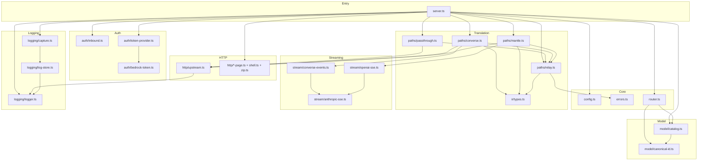

# Components

Major components and their responsibilities. Grouped by subsystem. Each entry
notes the source file and its key exported symbols.

---

## Component overview

---

## Entrypoint

### `server.ts`
The HTTP entrypoint built on `Bun.serve`. Holds a mutable `Runtime` (config,
token provider, `CatalogManager`, `LogStore`) that is swapped atomically on
hot-reload. Routing is a **declarative `ROUTES` table** (a `Route[]`); a single
generic handler matches the request against it, applies the route's auth/CSRF
gates, then invokes the handler with a per-request `RouteContext`.

- `main()` — load config, build runtime, start server, own `reloadRuntime`.
- `buildRuntime(config)` — assemble token provider + discovery client + catalog + log store.
- `createFetchHandler(getRuntime, reloadRuntime)` — build the `Bun.serve` fetch
  handler independently of the server, so routing + auth gates are unit-testable
  against plain `Request`s with a stubbed runtime. `getRuntime` reads the live
  (hot-reload-swapped) runtime; `reloadRuntime` validates + persists + rebuilds.
- `reloadRuntime(rawConfig)` (in `main`) — serialized validate → build → persist
  → atomic single-reference swap → stop the replaced `CatalogManager` **and**
  `LogStore`.
- `authenticateManagement(req, config)` — gates the management/observability API
  behind the inbound key (delegates to `authenticateInbound`).
- `assertCsrf(req, url)` — CSRF defense for state-changing POSTs: requires the
  `x-ccpp-csrf` header and rejects a cross-origin `Origin`.
- `resolvePort()` — parse `PORT` env with a NaN/range guard (fail fast).
- `runInference(...)` — parse model → route → select credential → dispatch to path handler.
- `dispatchMessages` / `dispatchCountTokens` / `dispatchChat` — endpoint handlers.
- `describeAuth` — reports effective outbound credential per provider (mints dev token if needed).
- `errorResponse` — renders any error as an Anthropic-style error body, logging
  4xx at `warn` and 5xx/unexpected at `error` (via `logging/logger.ts`).

The route table, its `Route`/`RouteContext` types, and the `exact()`/`prefix()`
matchers are documented in [`interfaces.md`](interfaces.md#http-api-inbound).

---

## Core

### `config.ts`
Full configuration lifecycle: load JSONC (comments stripped), interpolate
`${ENV}` references (bare refs fail fast on unset/empty; `${ENV:-default}`
supplies a bash-like default — empty allowed, meaning "configured but inactive
until the env var is set"), validate shape (fail fast), and serialize back to
disk with secrets restored to `${ENV}` form. Also computes region/host
derivations. `providers.bedrock` is optional (absent/empty credential =
Bedrock disabled).

Key exports: `loadConfig`, `saveConfig`, `serializeConfig`, `validateConfig`,
`interpolateEnv`, `hostForRegion`, `awsRegionForPrefix`, `awsRegionForKey`,
`externalProviderOrigin`, `DEFAULT_BEDROCK_HOSTS`. Types: `ProxyConfig`,
`BedrockProviderConfig`, `ExternalProviderConfig`, `RegionKey`,
`ProfilePreference`, `LoggingConfig`.

### `errors.ts`
Error taxonomy. `ProxyError` base carries `status` + `type`, accepts an
`options.cause` (threaded into `Error.cause` so a rethrow preserves the
root-cause chain), and renders an Anthropic-style error body via
`toAnthropicBody()`. Subclasses map to HTTP statuses (see
[`interfaces.md`](interfaces.md#error-taxonomy)): `UnauthorizedError`,
`BadModelIdError`, `BadRequestError`, `ModelNotFoundError`,
`UnsupportedProviderError` (unknown provider, distinct from `ModelNotFoundError`),
`UpstreamError`, `ConfigError`. `UpstreamError` carries `upstreamBody` (raw
upstream body, preserved unmodified for relay) and `context` (route/model
identifiers for logs only, never rendered to the client). `assertNever(value,
context?)` is an exhaustiveness guard for discriminated-union switches — a
compile error if a case is unhandled, a throw at runtime for an unexpected
on-the-wire value.

### `router.ts`
Maps a parsed `CanonicalId` to a fully resolved `RouteTarget` (provider,
backend, `translationPath`, origin, request/stream/count paths, resolved
`invocationId`). Uses the live catalog and config host/region derivation.

---

## Model

### `model/canonical-id.ts`
`parseCanonicalId` (splits on first three dots only), `formatCanonicalId`, and
`isAnthropic` (case-insensitive match on `claude`/`anthropic` in the native id).

### `model/catalog.ts`
Runtime discovery and the in-memory catalog.
- `DiscoveryClient` — DI seam; `createHttpDiscoveryClient` is the live impl
  (foundation-models, inference-profiles, Mantle `/v1/models`).
- `discoverExternalCatalog` — fetches each external provider's `modelsUrl`.
- `buildRegionCatalog` — maps raw discovery data to `DiscoveredModel[]`,
  associating inference profiles with base model ids.
- `Catalog` — immutable snapshot with keyed lookup.
- `CatalogManager` — holds the current catalog, schedules periodic refresh.
- `resolveInvocationId` — picks a `global.*`/regional profile id or the bare id
  per `profilePreference`.

---

## Translation paths

### `paths/relay.ts` (shared upstream/relay helpers)
Consolidates the upstream-handling patterns that were previously duplicated
across the three path handlers (P/C/M). Exports:
- `parseJsonObject(raw, label?)` — parse a JSON string at a trust boundary,
  rejecting non-objects with a `BadRequestError` (400) instead of a downstream
  corruption.
- `parseUpstreamJson<T>(upstream, route)` — read an OK upstream response's JSON
  as a validated object, throwing `UpstreamError` (502) on a non-JSON /
  non-object payload. Call only after `assertUpstreamOk`.
- `assertUpstreamOk(upstream, route, { requireBody? })` — assert the upstream is
  OK (and, for streaming, has a body); on failure reads the body best-effort and
  throws `UpstreamError` carrying route/model context.
- `relayHeadersFrom(upstream, names)` — build a relay header map copying only
  the named headers present on the upstream response.
- `PASSTHROUGH_RELAY_HEADERS` — the header names relayed verbatim from a
  passthrough upstream (`content-type`, `cache-control`).
- `irToAnthropicResponse(ir, model)` — serialize a provider-neutral IR response
  into an Anthropic Messages JSON body. **Both `converse.ts` and `mantle.ts`
  now import this from here** (the previously-duplicated local copies were
  removed); prompt-cache usage counters are emitted only when the IR carries
  them.

### `paths/passthrough.ts` (Path P)
`handlePassthroughMessages` / `handlePassthroughCountTokens`. Rewrites only the
`model` field, forwards Anthropic protocol headers, relays JSON/SSE and upstream
errors byte-for-byte (via `assertUpstreamOk` + `relayHeadersFrom` /
`PASSTHROUGH_RELAY_HEADERS`). No IR.

### `paths/converse.ts` (Path C)
`handleConverseMessages`. Translates Anthropic ⇄ Bedrock Converse via the IR:
`anthropicToConverseRequest`, `converseResponseToIr`, plus block/tool-choice
mappers and `mapConverseStopReason` (also used by the streaming bridge). Uses
`assertUpstreamOk` / `parseUpstreamJson` and the shared `irToAnthropicResponse`
(imported from `relay.ts`). Streams via `converseStreamToAnthropicSse`.

### `paths/mantle.ts` (Path M)
`handleMantleMessages`. Translates Anthropic ⇄ OpenAI Chat Completions via the
IR: `anthropicToOpenAIRequest`, `openAIResponseToIr`, plus `mapOpenAIFinishReason`
(also used by the streaming bridge). Uses `assertUpstreamOk` / `parseUpstreamJson`
and the shared `irToAnthropicResponse` (imported from `relay.ts`). Ignores
Mantle's `obfuscation` padding field.

---

## Streaming

### `stream/anthropic-sse.ts`
`AnthropicSseEmitter` — builds a `ReadableStream<Uint8Array>` emitting the
Anthropic Messages streaming grammar (`message_start`, `content_block_*`,
`message_delta`, `message_stop`, `ping`). Injects **synthetic ping** events
during silent gaps (default 5 s) so Claude Code does not abort long "thinking"
pauses. `formatSseEvent` handles framing.

### `stream/converse-events.ts`
`EventStreamDecoder` incrementally decodes Bedrock's binary
`vnd.amazon.eventstream` frames; `converseStreamToAnthropicSse` maps Converse
events to Anthropic SSE (feeding the emitter).

### `stream/openai-sse.ts`
`SseLineParser` buffers partial `data:` lines; `openAiStreamToAnthropicSse`
synthesizes Anthropic block boundaries (OpenAI has none) and re-emits streamed
tool-call argument fragments as ordered `input_json_delta` events.

---

## Auth

### `auth/inbound.ts`
`authenticateInbound` validates the presented credential (Bearer or `x-api-key`)
against configured keys using **constant-time** comparison. `HeaderReader` is a
structural type decoupling from concrete `Headers` implementations.

### `auth/bedrock-token.ts`
`generateShortLivedBedrockToken` replicates AWS's official token-generator
algorithm: SigV4-presign a `CallWithBearerToken` request via `aws4fetch`,
base64-encode, prefix `bedrock-api-key-`. `resolveBedrockCredential` passes
through a configured long-term key.

### `auth/token-provider.ts`
`createBedrockTokenProvider` returns a `RegionTokenProvider`: a region-agnostic
constant for a long-term key, or a per-region minting function in dev mode
(when the credential is the `dev`/empty sentinel and AWS env creds are present).
Dev mode keeps a **per-region token cache with in-flight de-duplication**: minted
tokens are region-scoped and short-lived, so the provider caches by region,
reuses an in-flight mint for concurrent callers of the same region, and re-mints
a skew before expiry. A failed mint is never cached (the entry is dropped so the
next call retries).

---

## HTTP & UI

### `http/upstream.ts`
Outbound helpers: `buildAnthropicHeaders` / `buildConverseHeaders` /
`buildOpenAIHeaders` and `postJson` (small linear-backoff retry on transient
429/5xx and network errors, logging each retry via `logging/logger.ts`;
non-transient responses returned for verbatim relay).

### UI pages
`registry-page.ts` (live registry HTML + snapshot JSON), `config-page.ts`
(config editor), `log-viewer-page.ts` (log browser), `chat-page.ts` (built-in
test chat), `shell.ts` (shared HTML shell/nav), `zip.ts` (dependency-free ZIP
builder for log exports).

---

## Logging

### `logging/logger.ts`
A dependency-free leveled, structured logger. Reads the active level once from
the `LOG_LEVEL` env (`debug`|`info`|`warn`|`error`, default `info`) via
`parseLevel`, gates emission against that level in `emit`, and appends
identifier-only ` key=value` fields with `formatFields` (values with whitespace
are quoted so a line stays parseable). Exports the `logger` object
(`debug`/`info`/`warn`/`error`), `errorMessage(err)` (safe message extraction
that never throws on non-`Error` values), and `newRequestId()` (an 8-hex-char
correlation id). Used by `server.ts` for request logging + `errorResponse`,
`http/upstream.ts` for retry logs, and `logging/capture.ts`/`logging/log-store.ts`
for best-effort diagnostics. Never logs secrets — callers pass identifiers only
(requestId, provider, model, status, latencyMs).

### `logging/log-store.ts`
`LogStore` persists, when enabled, deduplicated system prompts (by sha256 hash)
and per-turn session files. Types: `TurnRecord`, `TurnUsage`, `SystemPromptMeta`.
Every method is a no-op when logging is disabled; writes are best-effort. Writes
go through `writeJsonAtomic` (write to a unique temp file then `rename` over the
target, so a crash mid-write can never leave a truncated JSON file for readers).
`stop()` (idempotent) marks the store stopped so `isEnabled()` returns false and
`record*` calls become no-ops — called on hot-reload before the replacement
runtime swaps in, mirroring `CatalogManager.stop()`; in-flight writes settle.

### `logging/capture.ts`
`captureTurn` builds a `TurnRecord` from a proxy `Response`. For streaming, it
tees the SSE stream — one branch relays to the client unchanged, the other
accumulates events to reconstruct content, stop reason, and usage.

---

## Control CLI (`src/cli/`)

A separate entrypoint (not part of the request path) that operates the proxy
cross-platform. Invoked as `bun run cli <cmd>` or via the `bootstrap.sh` /
`bootstrap.ps1` shims (which install Bun first). Runs in `--local` (bare Bun
process) or `--docker` (docker compose) mode; Docker is the default when present.

### `cli/index.ts`
Command dispatch and run-mode resolution. Commands: `setup`, `up`/`start`,
`down`/`stop`, `restart`, `status`, `logs`, `config-claude`, `doctor`, `help`.
Flags: `--local` | `--docker` | `--rotate`. In local mode it manages a detached
Bun process via a pid file under `logs/`; in Docker mode it drives
`docker compose`. Reads client model ids from `.env` (never hardcoded in `src/`).

### `cli/bootstrap.ts`
Idempotent config bootstrap: copies `.env` / `config.local.jsonc` from their
committed examples when missing, and ensures a strong `PROXY_INBOUND_KEY` exists
(generates one unless a real token is already present; `--rotate` forces a new one).

### `cli/claude.ts`
`writeClaudeSettings` merges the `ANTHROPIC_*` env vars into
`~/.claude/settings.json` (backing up any existing file, timestamped). Sets
`ANTHROPIC_API_KEY=""` so Claude Code does not bypass the proxy.

### `cli/deps.ts`
OS-aware dependency detection/installation: `checkBun`, `checkDocker`,
`ensureClaudeCode` (official install script, else npm).

### `cli/bind-ip.ts`
`deriveBindIp` / `verifyBindIp` — derive a safe LAN IPv4 (RFC-1918, physical
interface, excluding VPN/virtual NICs) for LAN-only publishing.

### `cli/env.ts`
`.env` read/write helpers (`getEnvValue`, `setEnvValue`), auth-token generation,
and the placeholder-detection used by bootstrap.

### `cli/util.ts`
Shared process/logging helpers (`runInherit`, `runCapture`, `spawnDetached`,
`commandExists`, colored `info`/`ok`/`warn`/`die`).
