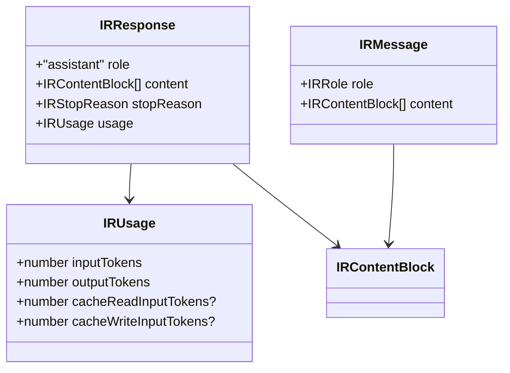
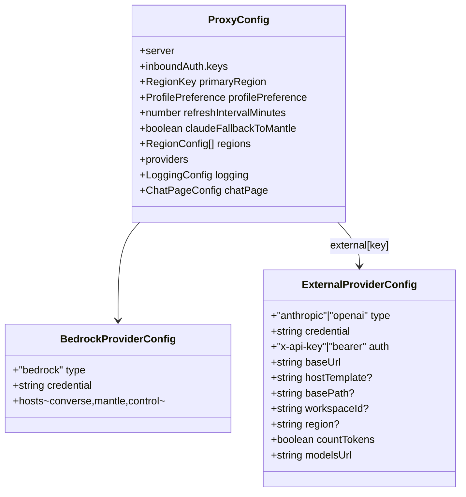

# Data Models

The core data structures: the canonical model id, the intermediate
representation (IR), the discovery/catalog models, the routing target, config,
and logging records.

---

## Canonical model id

Format: `<provider>.<backend>.<profilePrefix>.<nativeModelId>`

```ts
type Backend = "converse" | "mantle" | "anthropic" | "openai";

interface CanonicalId {
  provider: string;       // "bedrock" or an external provider key (e.g. "deepseek")
  backend: Backend;       // translation-path selector
  profilePrefix: string;  // "global" | "us" | "eu" — region + profile family
  nativeModelId: string;  // provider's real id; MAY contain dots/colons
}
```

Parsing splits on **only the first three dots**; everything after is the native
id. Examples:

```
bedrock.converse.global.anthropic.claude-sonnet-5
bedrock.mantle.us.qwen.qwen3-coder-30b-a3b-v1:0
deepseek.anthropic.global.deepseek-chat
```

---

## Intermediate representation (IR)

Defined in `src/ir/types.ts`. Provider-neutral, mirrors Anthropic's shape.
Used by Paths C and M; Path P bypasses it. **Pure types, no logic.**

The IR models only what the translators actually consume. Request-level knobs
(model, system, max_tokens, tools, tool_choice, temperature, top_p, stop
sequences, stream) are read directly from the parsed Anthropic body by each
translator, so there is **no** `IRRequest` wrapper type; likewise there is **no**
standalone `IRTool` type — tool definitions are passed through from the parsed
body. The IR types below are the exhaustive set exported by `src/ir/types.ts`.



### Content blocks (`IRContentBlock` union)

| Block | Fields | Purpose |
|---|---|---|
| `IRTextBlock` | `type:"text"`, `text` | Plain text. |
| `IRToolUseBlock` | `type:"tool_use"`, `id`, `name`, `input` | Model's request to invoke a tool. |
| `IRToolResultBlock` | `type:"tool_result"`, `toolUseId`, `content` (string), `isError?` | Result fed back to the model. |
| `IRImageBlock` | `type:"image"`, `mediaType`, `data` (base64) | Input image. |

### Enumerations

```ts
type IRRole = "user" | "assistant";
type IRStopReason = "end_turn" | "tool_use" | "max_tokens" | "stop_sequence";
type IRToolChoice =
  | { type: "auto" }
  | { type: "any" }
  | { type: "tool"; name: string }
  | { type: "none" };
```

The `IRStopReason` vocabulary is the canonical (Anthropic) one; the Converse and
OpenAI translators map their provider vocabularies onto it
(`mapConverseStopReason`, `mapOpenAIFinishReason`).

---

## Discovery & catalog models

Defined in `src/model/catalog.ts`.

```ts
interface DiscoveredModel {
  provider: string;                     // "bedrock" or external key
  awsRegion: string;                    // "" for external
  regionKey: RegionKey | "global";      // "global" for single-endpoint externals
  backend: Backend;
  nativeModelId: string;
  isAnthropic: boolean;
  supportsOnDemand: boolean;            // Converse: bare invocation allowed
  profiles: readonly string[];          // Converse: matching inference-profile ids
  streaming: boolean;
}
```

- `Catalog` — immutable snapshot; keyed by `regionKey|backend|nativeModelId`.
- `CatalogManager` — holds the current `Catalog`, refreshes on a timer.

Raw discovery shapes consumed (subsets): `FoundationModelSummary`
(`modelId`, `inferenceTypesSupported`, `responseStreamingSupported`,
`modelLifecycle.status`), `InferenceProfileSummary`
(`inferenceProfileId`, `status`, `models[].modelArn`), `MantleModel`
(`id`, `status`). External `/models` responses are read as `{ data: [{ id }] }`,
with a leading `models/` prefix stripped.

---

## Routing target

`RouteTarget` (`src/router.ts`) — the fully resolved destination for one
request. See [`interfaces.md`](interfaces.md#routetarget-routerts) for fields.

---

## Configuration model

Defined in `src/config.ts`. `${ENV}` references are interpolated at load and
restored on save.



- `RegionKey = "us" | "eu"`; `ProfilePreference = "global" | "regional" | "auto"`.
- `providers.bedrock` is required; `providers.external` is a keyed map of
  `ExternalProviderConfig`.
- `externalProviderOrigin(p)` computes the effective origin from `hostTemplate`
  (with `{workspaceId}`/`{region}` substitution) when present, else `baseUrl`.

---

## Logging records

Defined in `src/logging/log-store.ts`. Only written when logging is enabled.

```ts
interface TurnRecord {
  sessionId: string;
  canonicalModel: string;
  invocationModel: string;
  backend: string;
  translationPath: string;
  streamed: boolean;
  systemHash: string | null;   // sha256 of system prompt, deduplicated
  messages: unknown;           // client-sent Anthropic messages
  responseContent: unknown;    // assistant content blocks
  stopReason: string | null;
  usage: TurnUsage;            // { inputTokens, outputTokens }
  requestedAt: string;
  respondedAt: string;
}

interface SystemPromptMeta {
  hash: string; preview: string; firstSeen: string; lastSeen: string; count: number;
}
```

System prompts are stored once per unique content hash under `<dir>/<systemDir>/`;
turns are stored per session under `<dir>/<sessionDir>/<session-id>/`. `TurnUsage`
is the two-field token accounting (`inputTokens`/`outputTokens`) embedded in each
`TurnRecord`; `SystemPromptMeta` is the metadata returned by the log-viewer list
API, while the on-disk system-prompt file additionally carries the full `system`
content.

---

## Captured-fixture data model

`tests/fixtures/*` are **real upstream responses** captured once from live
provider endpoints (by `scripts/capture-fixtures.ts`), not hand-authored or
fabricated payloads. They are the pre-translation bodies exactly as the upstream
returned them, replayed through a `globalThis.fetch` mock so the real
translation/streaming/relay code runs against authentic provider data with no
network and no cost. Three on-disk encodings model the three upstream wire forms:

| Extension | Wire form | Example fixtures |
|---|---|---|
| `.json` | Non-streaming JSON body | `converse-text.json`, `openai-tool.json`, `anthropic-text.json`, `anthropic-count.json` |
| `.sse` | Text SSE stream (`data:` lines) | `openai-stream.sse`, `anthropic-stream.sse` |
| `.b64` | Base64-encoded binary `vnd.amazon.eventstream` | `converse-stream.b64` |

Fixtures are model output only (no secrets) and are safe to commit. Re-capture
them when a provider's upstream contract changes. See
[`workflows.md`](workflows.md#12-testing-lanes) for the two test lanes and the
capture step.
