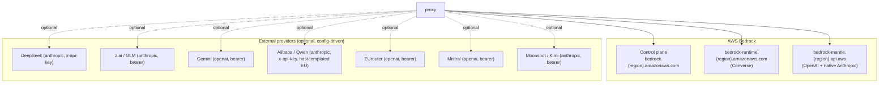

# Dependencies

External dependencies, upstream services, and the toolchain.

---

## Runtime dependencies

| Package | Version | Used by | Purpose |
|---|---|---|---|
| `aws4fetch` | 1.0.20 | `src/auth/bedrock-token.ts` | SigV4-presign a `CallWithBearerToken` request to mint short-lived **dev** Bedrock tokens. The **only** production runtime dependency. |

Everything else (HTTP server, streaming, crypto hashing, file I/O, testing)
relies on the **Bun** runtime and Node-compatible built-ins:

| API | Used by | Purpose |
|---|---|---|
| `Bun.serve` | `server.ts` | HTTP server. |
| `Bun.env` | `server.ts`, `config.ts`, `token-provider.ts` | Environment access. |
| `bun:test` | `tests/*` | Test runner. |
| `node:crypto` (`createHash`) | `logging/log-store.ts` | sha256 hashing for system-prompt dedup. |
| `node:fs/promises`, `node:path` | `logging/log-store.ts` | Log persistence. |
| `crypto.randomUUID` | `server.ts` | Anonymous session ids. |
| Web streams (`ReadableStream`, `TextEncoder/Decoder`) | `stream/*`, `logging/capture.ts` | SSE emission, eventstream decode, tee. |

The ZIP export (`http/zip.ts`) is a **dependency-free** implementation (custom
CRC32 + DOS datetime) — no archiver library.

---

## Development dependencies

| Package | Version | Purpose |
|---|---|---|
| `@biomejs/biome` | 1.9.4 | Lint + format. |
| `typescript` | 5.7.2 | `tsc --noEmit` type checking. |
| `@types/bun` | 1.1.14 | Bun type definitions. |

### Test infrastructure

The two test lanes (see [`workflows.md`](workflows.md#12-testing-lanes)) rely on
`bun:test` plus in-repo helpers and captured fixtures — no external test
libraries:

| Path | Role |
|---|---|
| `scripts/capture-fixtures.ts` | One-off, run manually with live creds (`bun run test:capture`). Drives the real handlers against live Bedrock while wrapping `globalThis.fetch` to record raw pre-translation upstream bodies into `tests/fixtures/`. |
| `tests/helpers/fetch-mock.ts` | Hermetic-lane `globalThis.fetch` mock that replays `tests/fixtures/*` (`.json`/`.sse`/`.b64`) and records outgoing requests for assertions. Stubs **only** the network edge. |
| `tests/helpers/live.ts` | Live-lane gating: `describeLive` (skips unless `RUN_LIVE=1` + AWS creds), `awsCreds()`, `providerKeyPresent()`. |
| `tests/fixtures/*` | Real upstream responses captured once from live endpoints; replayed by the hermetic lane. Model output only (no secrets), safe to commit. |

---

## Upstream service dependencies

### Bedrock

- **Regions** chosen by measured coverage: `us-east-1` (richest) and
  `eu-west-1` (richest EU with both backends).
- **One bearer token** authenticates control-plane discovery *and* inference on
  both backends. Short-lived tokens are region-scoped; a long-term key is
  region-agnostic.

### External providers

Each is optional and enabled via `config.providers.external`. Model ids are
discovered at runtime from each provider's `modelsUrl` — **no model ids are
hardcoded** in source or config. Per-provider verified specifics are documented
in the root `AGENTS.md` ("Custom Instructions" → "Verified facts").

| Provider | `type` | Auth | Notes |
|---|---|---|---|
| DeepSeek | anthropic | x-api-key | `count_tokens` supported. |
| z.ai / GLM | anthropic | bearer | Single global endpoint. |
| Gemini | openai | bearer | Discovery strips `models/` id prefix. |
| Alibaba / Qwen | anthropic | x-api-key | Host-templated (EU Frankfurt); discovery uses bearer. |
| EUrouter | openai | bearer | EU data-residency router (not openrouter.ai). |
| Mistral | openai | bearer | OpenAI-compatible. |
| Moonshot / Kimi | anthropic | bearer | No `count_tokens`; returns `thinking` blocks. |

> **Discovery always uses bearer**, even for `x-api-key` message providers,
> because the OpenAI `/models` convention is bearer (Alibaba's `/models` rejects
> `x-api-key`).

---

## Deployment dependencies

| Dependency | Used by |
|---|---|
| Docker + Docker Compose | `Dockerfile`, `docker-compose.yml`, `src/cli/` (`--docker` mode) |
| `oven/bun` (Alpine) base image | `Dockerfile` |
| Bun (host) | `bootstrap.sh`/`.ps1` install it if missing; `--local` mode runs the proxy as a bare Bun process |

The container publishes its port only on `${BIND_IP}` (LAN) + `127.0.0.1`,
never `0.0.0.0` (see [`architecture.md`](architecture.md#security-boundaries)).

---

## Dependency policy (from project rules)

- **No hardcoded model catalogs** — model/region specifics are discovered at
  runtime or read from config.
- **Mocks limited to the outbound `fetch` boundary; fixtures are real captured
  data** — the hermetic lane stubs only `globalThis.fetch` and replays authentic
  upstream responses captured from live endpoints (`tests/fixtures/`, via
  `scripts/capture-fixtures.ts`); all translation/routing/streaming code under
  test is the real implementation, never fabricated logic or hand-invented
  payloads. The live lane (`RUN_LIVE=1 bun test`) hits real endpoints with
  credentials from the environment and is the source of truth.
- **Never commit secrets** — `.env`, `config.local.jsonc`, and AWS credentials
  are git-ignored; referenced by env-var name only.
