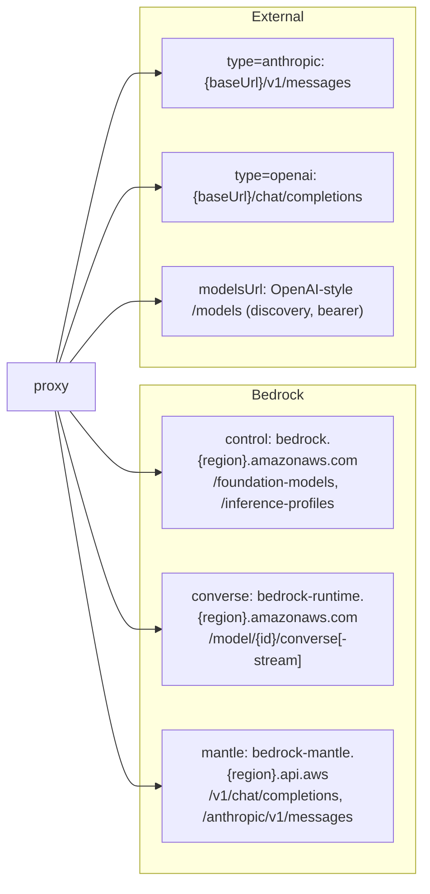

# Interfaces

APIs, internal interfaces (DI seams), and external integration points.

---

## HTTP API (inbound)

All routes are served by `Bun.serve` in `src/server.ts` through a single
`createFetchHandler`, which matches each request against a declarative `ROUTES`
table and applies that route's auth/CSRF gates before invoking its handler. The
proxy is addressed by Claude Code as an Anthropic Messages endpoint.

The **Auth** column reflects each route's `requiresAuth` flag (the gate applied
by the generic handler via `authenticateManagement`). Note the inference
endpoints carry `requiresAuth: false` in the table but **self-authenticate**
inside their dispatchers with the same inbound key.

### Inference & Anthropic-compatible endpoints

| Method | Path | Auth | Description |
|---|---|---|---|
| `POST` | `/v1/messages` | inbound key (self, in dispatcher) | Core inference. Body is an Anthropic Messages request; `model` is a canonical id. Returns Anthropic JSON or SSE stream. |
| `POST` | `/v1/messages/count_tokens` | inbound key (self, in dispatcher) | Token counting. Supported only for Claude passthrough (Path P) with a `countTokensPath`; otherwise `400`. |
| `GET` | `/v1/models` | none | Discovered canonical model ids as `{ data: [{ id }] }`, sorted. |
| `HEAD` | `/api/hello` | none | Connection-warming probe → `204`. Never errors. |

### Registry / status (human + machine)

| Method | Path | Auth | Description |
|---|---|---|---|
| `GET` | `/` or `/status` | none | Live registry HTML page. |
| `GET` | `/status.json` | none | Registry snapshot JSON. |

### Config management UI + API

| Method | Path | Auth | Description |
|---|---|---|---|
| `GET` | `/config` | none | Config editor HTML page (public markup; browser attaches the key on each fetch). |
| `GET` | `/api/config` | inbound key | Config as stored on disk (serialized). |
| `GET` | `/api/config/status` | inbound key | Per-region and per-external-provider model counts + active flags. |
| `GET` | `/api/config/auth` | inbound key | Effective outbound credential per provider (mints a dev SigV4 token when in dev mode). |
| `POST` | `/api/config` | inbound key **+ CSRF** | Validate + persist + hot-reload a new config. Requires the `x-ccpp-csrf` header and same-origin `Origin`. |

### Built-in chat test page

| Method | Path | Auth | Description |
|---|---|---|---|
| `GET` | `/chat` | none | Chat test page (only when `chatPage.enabled`). |
| `POST` | `/api/chat` | inbound key **+ CSRF** | Server-side chat inference reusing the routing/translation machinery and the server-side credential — no credential in the browser. Requires the `x-ccpp-csrf` header and same-origin `Origin`; also enforces `chatPage.enabled`. |

### Logging UI + API (meaningful only when logging enabled)

| Method | Path | Auth | Description |
|---|---|---|---|
| `GET` | `/logs` | none | Log viewer HTML page (public markup). |
| `GET` | `/api/logs/system` | inbound key | List stored (deduplicated) system prompts. |
| `GET` | `/api/logs/system/{hash}` | inbound key | A single system prompt record. |
| `GET` | `/api/logs/sessions` | inbound key | List captured sessions. |
| `GET` | `/api/logs/sessions/{session}` | inbound key | List turns in a session. |
| `GET` | `/api/logs/sessions/{session}/{turn}` | inbound key | A single turn record. |
| `GET` | `/api/logs/export/system` | inbound key | ZIP of all system prompts. |
| `GET` | `/api/logs/export/sessions?range=all\|today\|1h` | inbound key | ZIP of session turns for the range. |

Unknown routes return a `404` Anthropic-style error body.

> **HTML response headers.** Every served HTML page (`/`, `/status`, `/config`,
> `/logs`, `/chat`) is returned with a hardening header set: a
> `Content-Security-Policy` (`default-src 'self'`; scripts/styles allow
> `'unsafe-inline'` + the Tailwind/Alpine CDNs; `connect-src 'self'`;
> `object-src`/`base-uri`/`frame-ancestors` locked down),
> `X-Content-Type-Options: nosniff`, and `Referrer-Policy: no-referrer`.

---

## Inbound authentication contract

Claude Code presents the proxy's inbound key as either
`Authorization: Bearer <key>` or `x-api-key: <key>`. `authenticateInbound`
extracts and validates it (constant-time) against `config.inboundAuth.keys`.

> **Client gotcha:** `ANTHROPIC_API_KEY` must be empty on the client, or Claude
> Code prefers it over `ANTHROPIC_AUTH_TOKEN` and bypasses the proxy.
> `ANTHROPIC_BASE_URL` must **not** end in `/v1` (Claude Code appends
> `/v1/messages`).

### CSRF contract (state-changing management POSTs)

`POST /api/config` and `POST /api/chat` additionally require a CSRF check
(`assertCsrf`) on top of the inbound key: the request must carry the
`x-ccpp-csrf` header (a custom header only same-origin script can set without a
CORS preflight the server never approves), and if the browser sends an `Origin`
it must match the server's origin. Failure throws `UnauthorizedError` → `401`.

---

## Routing internals (`server.ts`)

Requests are matched against a declarative `ROUTES` table and dispatched by a
single handler built by `createFetchHandler(getRuntime, reloadRuntime)`
(extracted from `main()` so routing + auth gates are unit-testable against plain
`Request`s with a stubbed runtime; `getRuntime` reads the live runtime swapped on
hot-reload).

### `Route`
```ts
interface Route {
  method: string;
  name: string;                       // human-readable label (diagnostics)
  match: (pathname: string) => string[] | null; // captured params, or null to skip
  requiresAuth: boolean;              // gate behind the inbound key before the handler
  requiresCsrf?: boolean;             // POSTs: also require x-ccpp-csrf + Origin check
  handler: (ctx: RouteContext) => Response | Promise<Response>;
}
```
Matchers: `exact(...paths)` matches one of several equivalent exact pathnames
(returns `[]`); `prefix(base)` matches a prefix and captures the remaining path
as `/`-split, non-empty, `decodeURIComponent`'d segments (used by the log
system-hash / session routes). The chat page's shell route is registered only
when `chatPage.enabled`.

### `RouteContext`
The per-request bundle passed to every handler: `req`, `method`, `params`
(captured path segments), the live runtime references (`config`, `tokenProvider`,
`catalogManager`, `logStore`), `reloadRuntime`, and a **structural** `url` view
```ts
url: { searchParams: { get(name: string): string | null } }
```
(a minimal structural type, not the DOM/Bun `URL`, to avoid the lib collision
noted in `AGENTS.md`).

### Gates & helpers
- `authenticateManagement(req, config)` — runs before a `requiresAuth` handler;
  validates the inbound key via `authenticateInbound`.
- `assertCsrf(req, url)` — runs before a `requiresCsrf` handler (see the CSRF
  contract above).
- `resolvePort()` — parses `PORT` with a NaN/range guard (integer in `(0, 65536)`),
  defaulting to `8787`; throws on an invalid value (fail fast, not a silent NaN).

---

## Internal interfaces (dependency-injection seams)

These structural interfaces decouple the code and enable real test doubles.

### `HeaderReader` (`auth/inbound.ts`, `http/upstream.ts`)
```ts
interface HeaderReader { get(name: string): string | null }
```
Avoids depending on the global `Headers` type (which resolves ambiguously
between Bun and `undici-types` in tests).

### `DiscoveryClient` (`model/catalog.ts`)
```ts
interface DiscoveryClient {
  listFoundationModels(awsRegion: string): Promise<FoundationModelSummary[]>;
  listInferenceProfiles(awsRegion: string): Promise<InferenceProfileSummary[]>;
  listMantleModels(awsRegion: string): Promise<MantleModel[]>;
}
```
`createHttpDiscoveryClient` is the live implementation.

### `RegionTokenProvider` (`model/catalog.ts`)
```ts
type RegionTokenProvider = (awsRegion: string) => Promise<string> | string;
```
Returns a region-agnostic long-term key, or a per-region minted dev token.

### `RouteTarget` (`router.ts`)
The resolved outbound target for a single request: `provider`, `backend`,
`translationPath`, `awsRegion`, `origin`, `path`, `streamPath`,
`countTokensPath`, `invocationId`, `isAnthropic`.

---

## Outbound integration points



### Outbound header styles

| Route | Header | Notes |
|---|---|---|
| Converse (Path C) | `Authorization: Bearer` | **Rejects `x-api-key` (403).** |
| Mantle OpenAI (Path M) | `Authorization: Bearer` | Accepts either; proxy uses bearer. |
| Anthropic passthrough (Path P) | `x-api-key` **or** `Authorization: Bearer` | Per provider `auth` style; forwards `anthropic-version`/`anthropic-beta`. |
| External discovery (`modelsUrl`) | `Authorization: Bearer` | Always bearer by OpenAI `/models` convention, regardless of message-path auth. |

---

## Error taxonomy

All errors are rendered as an Anthropic-style body:
`{ "type": "error", "error": { "type": "<type>", "message": "<message>" } }`.

`ProxyError` is the base: it carries `status` + `type`, accepts an
`options.cause` threaded into `Error.cause` (so a rethrow preserves the
root-cause chain for the top-level logger), and renders the body via
`toAnthropicBody()`.

| Class | HTTP | `type` | Meaning |
|---|---|---|---|
| `UnauthorizedError` | 401 | `authentication_error` | Inbound credential (or CSRF header/origin) missing/invalid. |
| `BadModelIdError` | 400 | `invalid_request_error` | Canonical model id unparseable. |
| `BadRequestError` | 400 | `invalid_request_error` | Body invalid/unsupported. |
| `ModelNotFoundError` | 404 | `not_found_error` | Model absent from catalog for target region/backend. |
| `UnsupportedProviderError` | 404 | `not_found_error` | Named provider not configured (distinct from "known provider, unknown model"). |
| `UpstreamError` | upstream status (or 502) | `api_error` | Upstream returned an untranslatable error / non-JSON body; raw body preserved. |
| `ConfigError` | 500 | `config_error` | Misconfiguration at startup/request time. |

`UpstreamError` carries the upstream `status`, an `upstreamBody` (the raw
upstream body, preserved unmodified — Claude Code's retry logic matches on
upstream error wording), and a `context` map (route/model identifiers surfaced
in logs only, never in the client body). `ConfigError` also accepts an
`options.cause`.

`assertNever(value, context?)` is the exhaustiveness guard used at
discriminated-union switch defaults: it is a compile error if a case is
unhandled, and throws with the offending value at runtime for an unexpected
on-the-wire enum the types did not anticipate.
