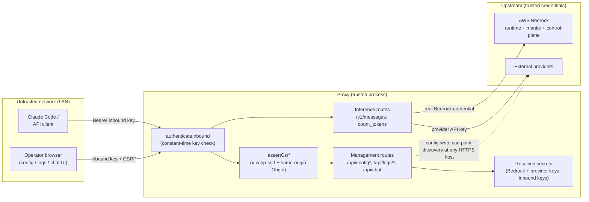

# Threat Model

> **Scope.** This document describes the security model of the proxy: its trust
> boundaries, the assets it protects, the controls in place, and the risks that
> are **accepted by design**. The binding, hand-maintained source of truth for
> the two accepted exposures is the root
> [`AGENTS.md`](../AGENTS.md) "Threat model (operator-trust boundary)" and
> "Security & configuration" sections; this file expands on them for reviewers.
> If the two ever disagree, `AGENTS.md` wins.

---

## Trust model in one line

The proxy has **two trust tiers**: an authenticated **operator** (holder of the
inbound key) is trusted; everyone else is untrusted. The network layer (LAN-only
bind) reduces who can reach the surface at all; the inbound key gates who can use
it; CSRF + CSP protect the browser-driven management surface.

---

## Trust boundaries

The **LAN-only bind** is a network-layer control that sits in front of all of
this: the service is published only on `${BIND_IP}` (a private RFC-1918 IPv4) +
`127.0.0.1`, never `0.0.0.0` and never a VPN/virtual interface. It reduces
reachability but is **not** a substitute for the inbound-key gate (the service
also runs in Docker on a LAN, so loopback-only gating was rejected).

---

## Assets

| Asset | Where it lives | Protection |
|---|---|---|
| **Inbound key** (`PROXY_INBOUND_KEY`) | `.env` (git-ignored) → config | Constant-time compare; gates every management + inference route. Highest-value credential. |
| **Bedrock credential** | `.env` / config; resolved at load | Never logged; sent only to Bedrock hosts. Long-term key region-agnostic; dev tokens are short-lived, region-scoped, minted on demand. |
| **External-provider API keys** | `.env` / config | Never logged; sent only to the configured provider host with its declared auth style. |
| **Minted SigV4 dev token** | in-memory (per-region cache) | Never returned by any endpoint — `describeAuth` exposes metadata only. Regenerable. |
| **Captured turn logs** | `logs/` (config-gated, git-ignored) | Written `0o600`; session ids sanitized against path traversal. |

---

## Controls in place

| Control | Mechanism |
|---|---|
| **Inbound authentication** | `authenticateInbound` (constant-time) on all inference + management routes. |
| **CSRF protection** | `assertCsrf` requires the `x-ccpp-csrf` header **and** a same-origin `Origin` on `POST /api/config` and `POST /api/chat`. |
| **Browser hardening** | HTML pages carry `Content-Security-Policy`, `X-Content-Type-Options: nosniff`, and `Referrer-Policy: no-referrer`. HTML interpolation is escaped (`escapeHtml` / `jsonForScript`). |
| **Network exposure** | LAN-only publish (`${BIND_IP}` + `127.0.0.1`), never `0.0.0.0`/VPN. |
| **Secret persistence** | `${ENV}` references are restored on UI save, so resolved secrets are never written back into `config.local.jsonc`. |
| **Secret redaction** | Minted dev token never leaves the process; logs reference secrets by env-var name, never value. |
| **Path-traversal defense** | `LogStore.safeSessionId` rejects `.`/`..` and enforces a containment check; the session route allow-lists the segment. |
| **Transport for external discovery** | `isSecureExternalUrl` enforces `https://` for external provider URLs. |
| **Trust-boundary parsing** | Untrusted JSON (inbound bodies + upstream responses) goes through `parseJsonObject` / `parseUpstreamJson`, never a bare `JSON.parse(...) as T`. |
| **Resource bounds** | Upstream fetches have per-attempt timeouts + client-abort propagation; log capture cancels on disconnect + a wall-clock cap; ZIP export enforces entry/size limits; capture enforces a byte cap. |

---

## Accepted risks (by design)

These are **not defects** — they follow from the "authenticated operator is
trusted" model and are documented so they aren't mistaken for bugs. See
[`AGENTS.md`](../AGENTS.md) for the authoritative wording.

### 1. `GET /api/config` returns resolved secrets to any valid-key holder

The authenticated config response includes the resolved Bedrock credential,
external-provider API keys, and the inbound keys in cleartext — intentional, so
the operator can view/edit the keys they manage (reveal-on-demand in the UI).
**Blast radius:** a single leaked inbound key exposes *every* configured secret.
Rotate the inbound key (`bun run cli setup --rotate`) if exposure is suspected.
*If operators are not trusted*, mask secrets (last-4) in the GET response —
deliberately not done today.

### 2. Authenticated config-write == blind SSRF-with-credential

An authenticated operator can set an external provider's `modelsUrl`/`baseUrl` to
an arbitrary host; discovery then fetches it **with a Bearer credential**, and
message handlers fetch derived paths. `isSecureExternalUrl` blocks plain-HTTP
(so `http://localhost`→metadata probes fail), but internal/link-local **HTTPS**
hosts (e.g. `https://169.254.169.254`, RFC-1918) remain reachable. Inherent to a
*configurable* proxy and admin-gated. *If operators are untrusted*, add an
origin allow/deny list for discovery + message fetches — deliberately not done
today; the LAN bind limits reachability.

---

## Out of scope / non-goals

- **Multi-tenant isolation.** The proxy is single-operator; there is no
  per-user authorization within the inbound-key tier.
- **Rate limiting / quota enforcement.** Not implemented; the LAN bind + trusted
  operator model is the mitigation. A public deployment would need a gateway in
  front.
- **Gateway-side response caching.** Intentionally omitted (leakage risk, low
  hit rate for coding); provider-native prompt caching is forwarded verbatim.
- **Secrets management / rotation automation.** Secrets live in `.env`/config;
  rotation is manual (`--rotate` for the inbound key).

---

## If you are deploying to an untrusted network

The defaults assume a trusted operator on a LAN. To harden for a hostile
environment, in priority order:

1. Put an authenticating reverse proxy / API gateway in front (TLS, rate limits,
   per-user auth).
2. Mask secrets (last-4) in `GET /api/config` instead of returning resolved
   values.
3. Add an egress allow/deny list for discovery + message fetches (block
   link-local / RFC-1918 / cloud-metadata IPs).
4. Rotate the inbound key regularly and treat it as a high-value credential.
