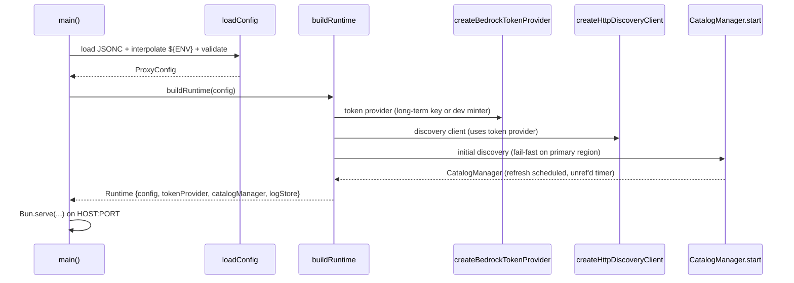
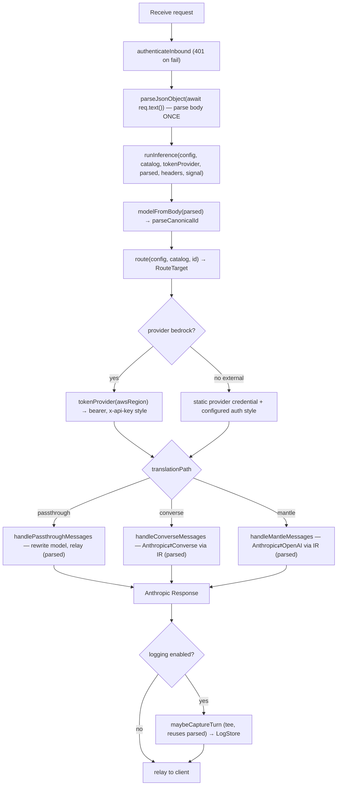
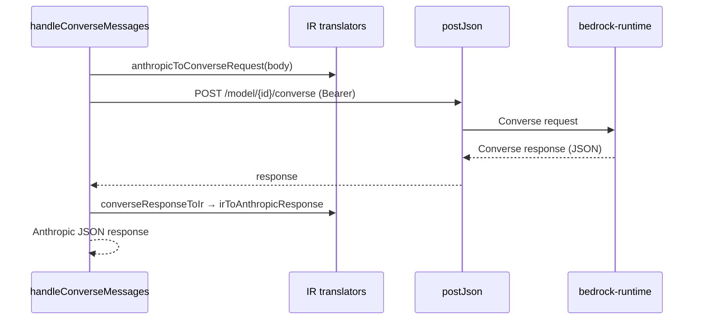
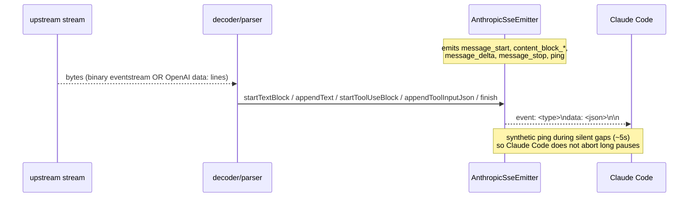
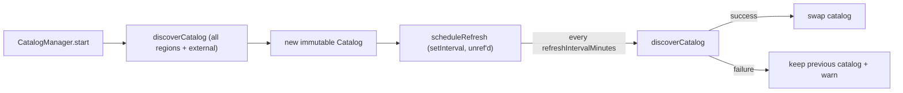
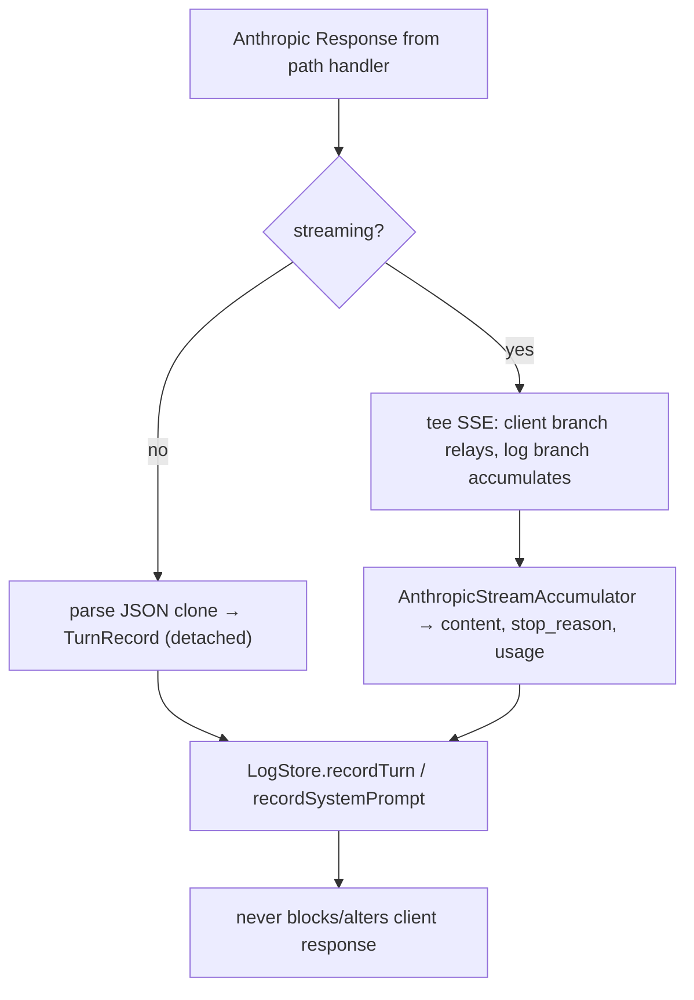
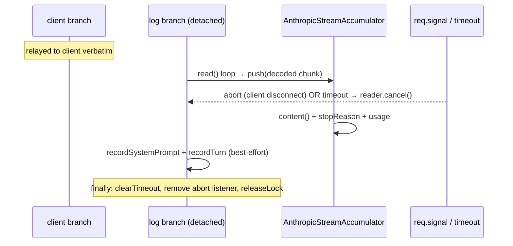
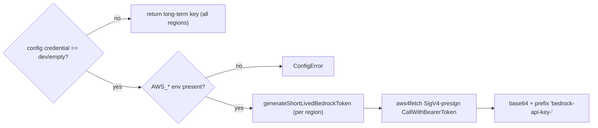
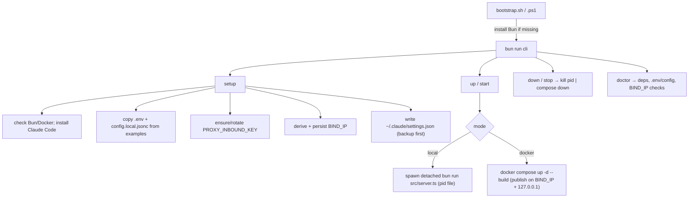

# Workflows

Key runtime processes, end to end.

---

## 1. Startup & runtime construction



Primary-region discovery failure aborts startup. Non-primary and external
provider discovery failures are logged and skipped.

---

## 2. Inference request (`POST /v1/messages`)

The inbound body is parsed **once** (`parseJsonObject(await req.text())`) at the
trust boundary; the resulting object is threaded through `runInference` (which
reads `model`, routes, and dispatches) and reused for capture — no handler
re-parses the body.



The internal chat endpoint (`POST /api/chat`) reuses the same `runInference` +
`maybeCaptureTurn` machinery: it parses its own `{model, system?, messages,
stream?}` body with `parseJsonObject`, builds a standard Anthropic request
object, and dispatches with the server-side credential.

---

## 3. Translation — Path C (Converse), non-streaming



Path M (Mantle) is analogous via `anthropicToOpenAIRequest` /
`openAIResponseToIr`, calling `/v1/chat/completions`.

---

## 4. Streaming translation → Anthropic SSE



- **Converse** streams binary `vnd.amazon.eventstream` frames decoded by
  `EventStreamDecoder`.
- **Mantle/OpenAI** streams `data: {json}` lines (terminated by `data: [DONE]`)
  parsed by `SseLineParser`; block boundaries are synthesized (OpenAI has none)
  and tool-call argument fragments re-emitted as `input_json_delta`.
- **Passthrough** relays the upstream Anthropic SSE unchanged.

---

## 5. Runtime discovery & refresh



---

## 6. Config hot-reload (`POST /api/config`)

`reloadRuntime` is serialized by a single-flight `createSerializer()` mutex
(a promise chain), so concurrent `POST /api/config` calls apply strictly in
order — no interleave, no lost reload, no leaked `CatalogManager` timer. The
new runtime is **validated and fully built (including discovery) BEFORE the
config is persisted**, so a build/validation failure never writes a broken
config that would brick the next boot. On success the single runtime reference
is swapped atomically, then exactly the replaced `CatalogManager` and `LogStore`
are stopped (symmetric lifecycle). If `saveConfig` fails after the build, the
just-built runtime's `CatalogManager` is stopped and the running runtime is left
untouched.

```mermaid
sequenceDiagram
    participant UI as Config UI
    participant SR as serializeReload (single-flight mutex)
    participant V as validateConfig
    participant BR as buildRuntime (token + discovery + catalog + store)
    participant S as saveConfig
    participant RT as runtime reference

    UI->>SR: POST /api/config (raw config)
    SR->>V: validateConfig(raw)  %% throws → running runtime untouched
    SR->>BR: buildRuntime(next)  %% build + discover BEFORE persist; throws → untouched
    SR->>S: saveConfig (restore ${ENV} for secrets)
    Note over SR,S: save fails → stop just-built catalog, keep running runtime
    SR->>RT: atomic single-reference swap (runtime = newRuntime)
    SR->>RT: previous.catalogManager.stop(); previous.logStore.stop()
    SR-->>UI: { ok: true }
```

`saveConfig` restores `${VAR}` references for secret fields so a resolved secret
is never persisted to `config.local.jsonc`.

---

## 7. Log capture (best-effort tee)



The detached streaming log-branch pump is bounded two ways so it can never
outlive the useful request: the log-branch reader is cancelled when the inbound
`req.signal` aborts (client disconnect) **and** by a wall-clock timeout
(`LOG_BRANCH_TIMEOUT_MS`, hung/slow upstream). Without these, a disconnected
client would leave the tee'd log branch pulling the upstream to completion —
holding the socket open and burning tokens/cost. A separate `MAX_CAPTURE_CHARS`
cap bounds accumulator memory (content past the cap is marked truncated).



---

## 8. Dev token minting (local, no long-term key)



Short-lived tokens are region-scoped, so one is minted per region; a long-term
key is region-agnostic.

---

## 9. Operator lifecycle (control CLI)

The CLI (`src/cli/`, `bun run cli <cmd>`, or via `bootstrap.sh`/`.ps1`) drives
setup and run in `--local` (bare Bun) or `--docker` (compose) mode.



- `setup` is idempotent and never overwrites an existing real auth token unless
  `--rotate` is passed.
- Docker mode **requires** a `BIND_IP`; local mode binds the server directly to
  the derived LAN IP (falling back to `127.0.0.1`).
- Client model ids (`ANTHROPIC_MODEL`/`ANTHROPIC_SMALL_FAST_MODEL`) are read
  from `.env`, keeping model ids out of `src/`.

---

## 12. Testing lanes

Two lanes exercise the **real** translation/routing/streaming code; the mock is
confined to the outbound HTTP boundary (`globalThis.fetch`), and the fixtures it
replays are authentic captured upstream responses (never fabricated).

- **Hermetic lane (merge gate)** — `bun run test:unit` (`bun test`). Live suites
  register themselves via `describeLive` (`tests/helpers/live.ts`) and become
  `describe.skip` unless `RUN_LIVE=1`, so this lane touches no network. The
  fixture suites install the `globalThis.fetch` mock from
  `tests/helpers/fetch-mock.ts` and replay `tests/fixtures/*` (`.json` bodies,
  `.sse` text streams, base64 `.b64` binary eventstreams) through the real
  handlers — deterministic, zero provider cost.
- **Live lane (source of truth)** — `bun run test:live` (`RUN_LIVE=1 bun test`).
  `describeLive` runs only when `RUN_LIVE=1` **and** AWS creds are present;
  `awsCreds()` reads them in `beforeAll`, and `providerKeyPresent()` lets
  external-provider suites skip individually when a provider key is absent. This
  lane hits real endpoints and is the ultimate source of truth.

```mermaid
flowchart LR
    CAP["bun run test:capture<br/>(scripts/capture-fixtures.ts)"] -->|records raw upstream| FIX["tests/fixtures/*.json|.sse|.b64"]
    FIX --> HERM["Hermetic: bun run test:unit"]
    HERM --> FM["fetch-mock.ts replays fixtures via globalThis.fetch"]
    FM --> REAL["real handlers (Path P/C/M) run"]
    LIVE["Live: RUN_LIVE=1 bun test"] --> ENDP["real provider endpoints (creds from env)"]
    ENDP -.re-capture on contract change.-> CAP
```



The capture step (`bun run test:capture` → `scripts/capture-fixtures.ts`) is run
manually with live creds; it drives the real handlers against live Bedrock while
wrapping `globalThis.fetch` to record the raw pre-translation upstream bodies
into `tests/fixtures/`. Re-run it when a provider's upstream contract changes.
